The Toll Of Traffic
==================

## Table of contents
* [Introduction: Business Problem](#introduction)
* [Data](#data)
* [Methodology](#methodology)
* [Analysis](#analysis)
* [Results and Discussion](#results)
* [Conclusion](#conclusion)

## Business Problem Intorduction
---

_No Development is a better prospect for a city if its heading for an unplanned one._

__Bangalore__ (known officially as _Bengaluru_ ) has seen rapid expansion and development in the recent decades. Though it has been beneficial to its economy and population, the sudden influx of population and increasing number of vehicles on the road has put a huge strain on the city's roads and its commuters.

The city's condition is so bad that it is regularly placed on top for world's most congested cities.

References:

[Why is Bangalore stuck in Traffic Jams](https://www.bbc.com/news/world-asia-india-38155635)

[Bangalore - The World's most traffic congested city](https://www.indianfolk.com/nama-bengaluru-worlds-traffic-congested-city/)

[Tom-Tom Traffic Index - Bangalore](https://www.tomtom.com/en_gb/traffic-index/bengaluru-traffic/)

The main culprit of the problem seems to be unplanned development of infrastructure and a road network not suitable for daily commutes.

The picture below describes the problem aptly. It is a view of Bangalore's Richmond Neighbourhood. We see that some roads remain quite empty and others are occupied 18 - 20 hours a day. Credits for the picture go to Deccan Herald.

The traffic also takes a toll on the economy of the city.

[The Cost Of Traffic on Cities in India](https://timesofindia.indiatimes.com/india/traffic-congestion-costs-four-major-indian-cities-rs-1-5-lakh-crore-a-year/articleshow/63918040.cms#:~:text=NEW%20DELHI%3A%20Traffic%20congestion%20during,conducted%20by%20global%20consultancy%20firm.)

The recent introduction of metro lines seemed a way forward in tackling this problem. But alas, delayed projects for building the required infrastructure for metros to operate on a full scale and the high price of metro travel seem to give little hope.
And thus would not provide a solution in the recent future.

This project aims to cluster neighbourhoods in Bangalore to find points is the road network which form a bottleneck for traffic flow.

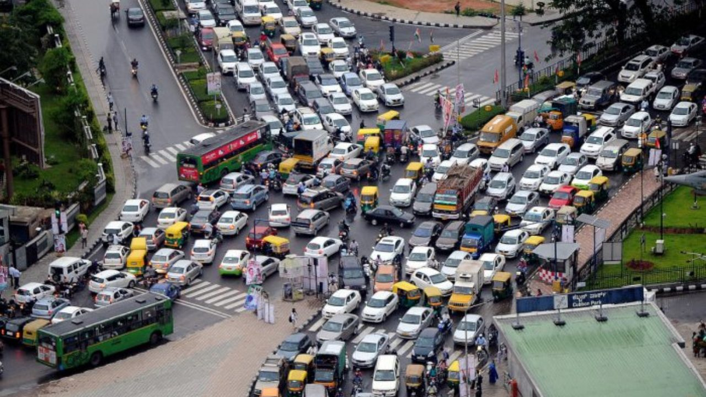

## Data sources

---

The project uses the following data sources:  

* [Geospacial Coordinates for Bangalore](https://www.kaggle.com/rmenon1998/bangalore-neighborhoods)

    The dataset provides the data for location coordinates of all nighborhoods in Bangalore and some.
    

* __Goepy Library__ is used to get revese geocoding for locations.

* __Foursquare API__ to get data for venues in a neighborhood.

    "Foursquare is the most trusted, independent location data platform for understanding how people move through the real world."

    We need a Foursquare Developer account to use its API. 
    The regular account provides 950 API calls a day for extracting location data in any neighborhood.
   

[Foursquare API - Getting Started Guide](https://developer.foursquare.com/docs/places-api/getting-started/)

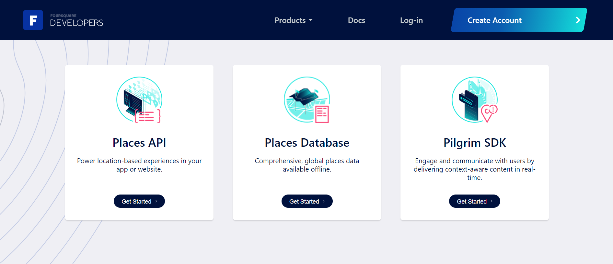

## Data cleaning
---

The data source used for plotting neighborhoods contains data for _latitude_ and _longitude_ of neighborhoods.

The data is mostly comoposed of neighborhoods in Bangalore but has many outliers.

Folium library is used to create the following map depicting neighborhoods in the dataset.

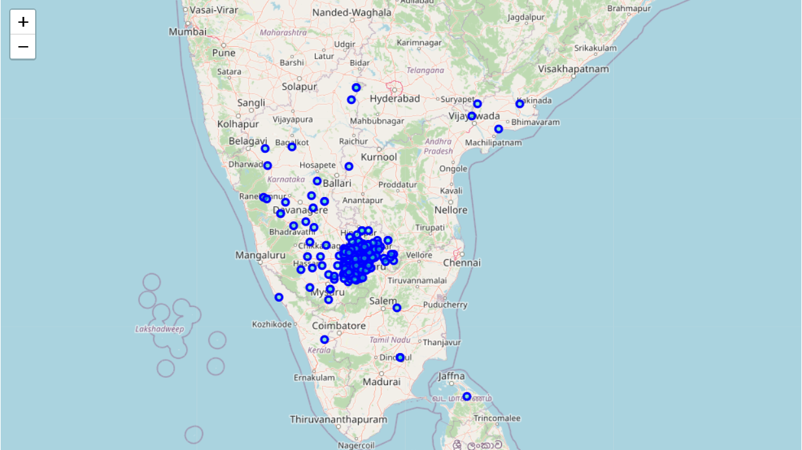

We see that the DataSet contains areas beyond the state of Karnataka and indeed beyond India.

We now clean the dataset to remove the outlieres and restrict the neighborhoods to Bangalore and its outskirts.

Here is the top 5 rows of the cleaned dataset for coordinates.

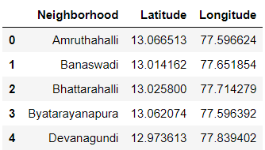

<strong>The map after cleaning of dataset is as follows.</strong>

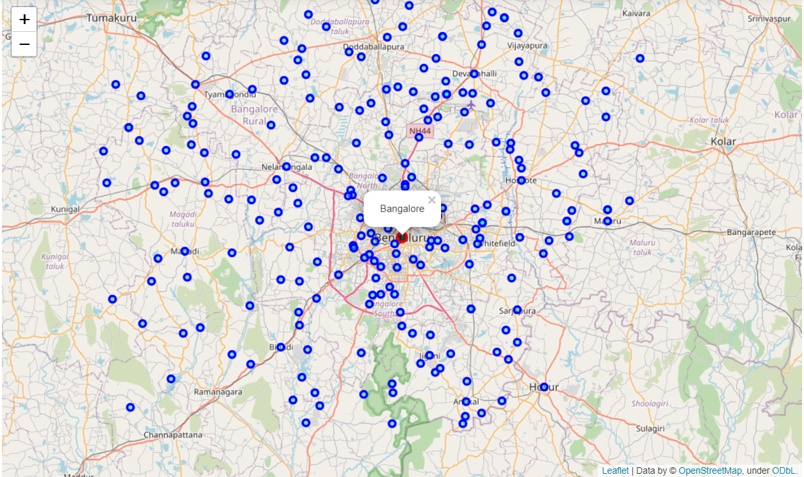

__We see that a total of 101 neighborhoods remain after cleaning the data__

As we now have a cleaned dataset ready for analysis.

Let us proceed with analysis.

## Methodology 

---

I utilized the Foursquare API to explore the neighnorhoods and segment them.

The limit was set capped at 100 venues and a search radius of 1000 meters for each neighnorhood from their given latitude and longitude information.

Here is a head of the dataframe created with Venues name, category, latitude and longitude informations returned from Forsquare API.

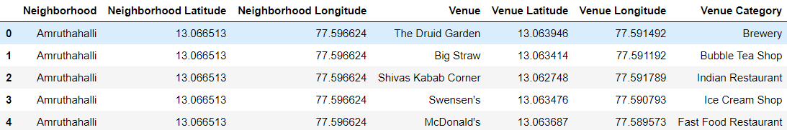

The table is a merged form of neighborhoods with the nearby venues to each one.

The newly created dataset contains longitude and latitude values for venues as well as the neighborhood.

The Category of venue was also saved.

__A total of 1215 venues were returned from the API.__

Next, we count and plot the number of venue categories returned .

We see that a total of 182 unique categories of venues were returned.

Plotting the top 20 venues that have the highest frequency we see the following bar graph.

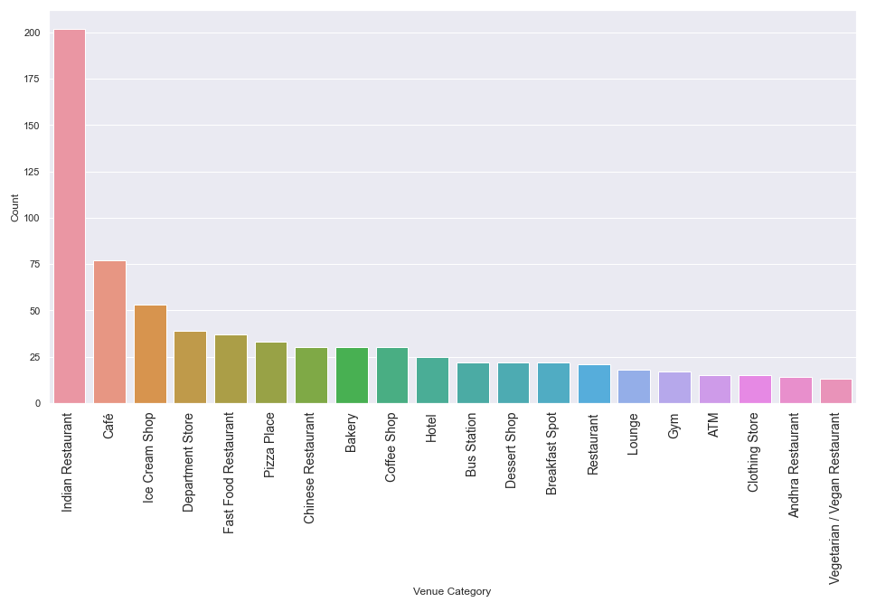

The bar plot shows us that the most common venues returned are:

* __Indian Restaurants__
* __Cafes__
* __Ice Cream Shops__

__Next, we plot the number of veneus returned per neighborhood to see the distribution of venues provided for each neighborhood.__

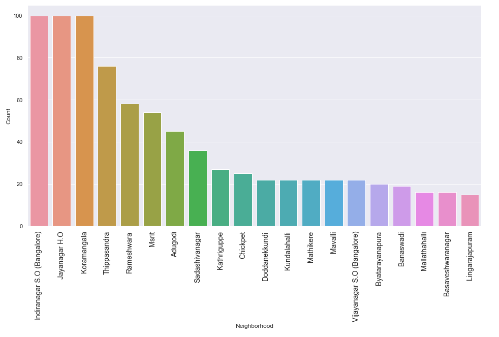

An observation was made that the __number of venues returned for each neighborhood differ greatly__.

With posh areas like __Indiranagar, Jayanagar and Koramangala__ having reached the 100 cap.

While no venues were returned for many neighborhoods.

This could be a problem with the foursquare API.

__As the next course of action we try to find the most common venues in each neighborhood__

We create a dataframe to show the top 10 most common venues of each neighborhood by grouping the last dataframe by neighborhood values.

A summary of the dataframe is as follows.

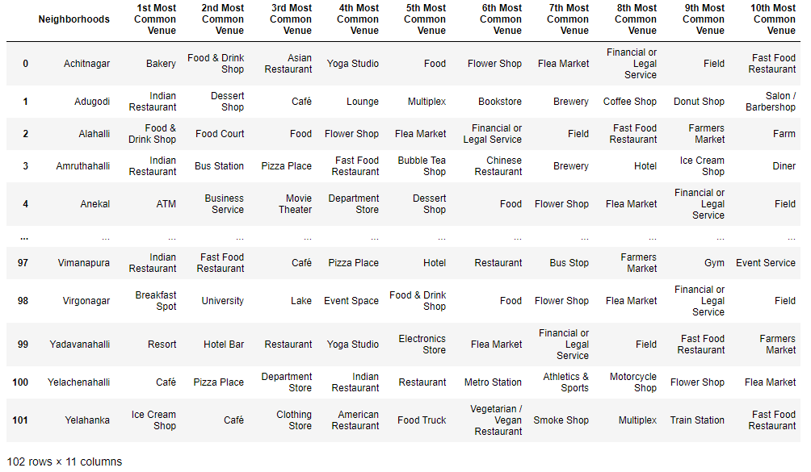

## Analysis 
---

We now analyse the data at hand using K means clustering.

We have some common venue categories in the dataframe.

K-Means algorithm is one of the most common cluster method of unsupervised learning and thus will be an effective algorithm for clustering this kind of data.

First we find the number of clusters the neighborhoods should be grouped into.

For this purpose the elbow method was used where we run the K means algorithm for a different number of clusters and find the knee of the graph or where the graph flattens.

The following graph is obtained while running the K means for number of clusters rangind from 1 to 25.

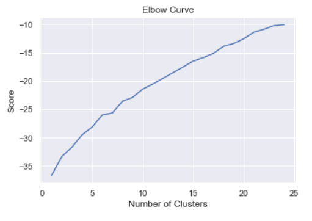

The elbow is not definite in the curve but the curve starts to become stable around 6.

Thus 6 was used as the number of clusters.

## Results and Discussion 
___

After clustering the neighborhoods, the custer labels were added back to the dataset for plotting.

The neighborhoods were grouped into 6 clusters by KNN as shown below.

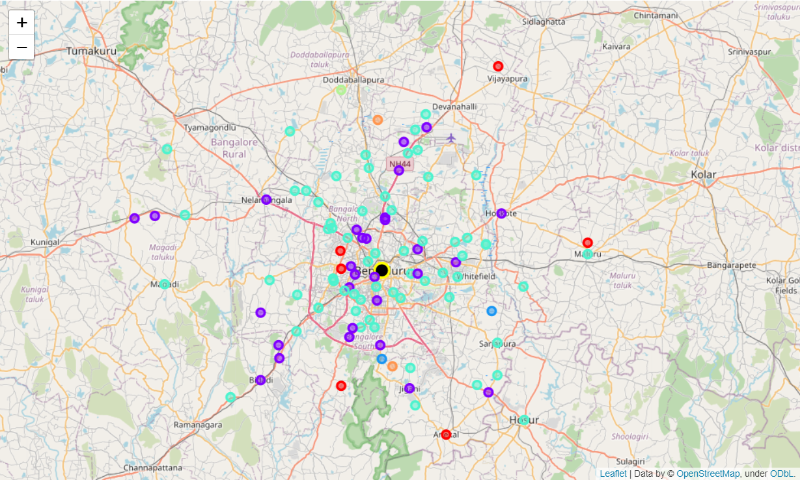

The following observations were made.

* Cluster 0 is mainly composed of financial areas and markets.

* Cluster 1 is mainly composed of resteraunts and shopping districts along with areas for public transport.

* Custer 2 is composed of 2 locations both on the outskirts of the city and have a remarkebly similar layout in terms of most common locations. These are most likely locations on which the API couldn't get enough data.

* Cluster 4 is just a town on city outskirts with marksets, restaurants and farms.

* Cluster 5 like Cluster 2 is composed of 2 neighborhoods for which the API would't have provided enough data. The two neighborhoods here too are almost identical in their common venues.

## Conclusion 
___

I made the following conclusions from the result:

We can conculde from the above results that cluster 1 and 3 were the largest clusteres formed.

Cluster 0 appears to be a financial district and thus will recieve highest traffic and footfall on weekdays composed of people going for jobs.

Cluster 1 is composed of shopping districts and public transport stops. These neighborhoods tend to have traffic in rush hours as due to commuters going to work or returning from it.

Cluster 2, 4 and 5 are mostly composed of towns on the outskirts of the city which do not have a problem of packed roads.

Cluster 3 is the largest cluster and is composed mostly of food courts and places of Entertainment like movie theatres. 
These places are most likely to recieve a higher amount of traffic and more footfall on weekends composed of families shopping and people out for leisure.

__The solutions for the problem at hand seem to be:__

1. The roads are choked due to a large number of people commuting to work through same highways. So more flyovers should be built.

2. Neigborhoods lie mostly near specific parts of Ring Road which will be a problem as many try to commute to same areas at same time. The roads in these areas should recieve constant monitoring.

3. Promotion and encouragement of public transports.

4. Metro seems a very viable option for this pupose so more metro lines should be laid and prices should be lowered.

5. Avoid central parts of city for commute during weekwnds.

### _“The road is hard, and you have to get accustomed to it.”_
